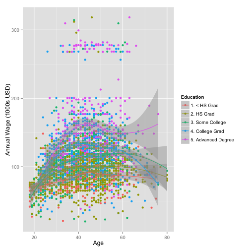

Mid-Atlantic Wage Explorer (MAWE)
========================================================
author: Guido Gallopyn
date: 11/20/2015

Introduction
========================================================

**MAWE** was built to simplify exploration of the Mid-Atlantic wage data. It allows for investigation of  influence of predictor variables in the data set on wage as outcome. 

- **Plots** : scatter plots of wage data along a selected predictor **x variable**, and coloring of data points according to a selected **color variable**, and allows to add locally weighted scatter-plot smoothing lines (LOESS).

- **Summaries**: summary data by the x and color variables selected.

- **Tables**: shows number of observations by the x and color variables selected.

Mid Atlantic Wage Data Set
========================================================


Data is derived from the *March 2011 Supplement to Current Population Survey data*. (http://thedataweb.rm.census.gov/TheDataWeb), and contains 3000 observations with 12 variables


```
 [1] "year"       "age"        "sex"        "maritl"     "race"      
 [6] "education"  "region"     "jobclass"   "health"     "health_ins"
[11] "logwage"    "wage"      
```

Plots
========================================================

 

***
- Scatter plot showing Wage on Y-axis

- Selection of X-axis variable (here Age)

- Selection of Color variable (here Education)

- LOESS lines per color factor level (here Education)
 
Summaries
========================================================

<!-- html table generated in R 3.1.1 by xtable 1.7-3 package -->
<!-- Thu Nov 20 15:17:27 2014 -->
<TABLE border=1>
<TR> <TH>  </TH> <TH> Year </TH> <TH> 1. Industrial </TH> <TH> 2. Information </TH>  </TR>
  <TR> <TD align="right"> 1 </TD> <TD align="right"> 2003 </TD> <TD align="right"> 98.9 </TD> <TD align="right"> 115.0 </TD> </TR>
  <TR> <TD align="right"> 2 </TD> <TD align="right"> 2004 </TD> <TD align="right"> 104.7 </TD> <TD align="right"> 116.9 </TD> </TR>
  <TR> <TD align="right"> 3 </TD> <TD align="right"> 2005 </TD> <TD align="right"> 104.7 </TD> <TD align="right"> 115.6 </TD> </TR>
  <TR> <TD align="right"> 4 </TD> <TD align="right"> 2006 </TD> <TD align="right"> 102.9 </TD> <TD align="right"> 126.4 </TD> </TR>
  <TR> <TD align="right"> 5 </TD> <TD align="right"> 2007 </TD> <TD align="right"> 100.9 </TD> <TD align="right"> 123.6 </TD> </TR>
  <TR> <TD align="right"> 6 </TD> <TD align="right"> 2008 </TD> <TD align="right"> 105.9 </TD> <TD align="right"> 124.0 </TD> </TR>
  <TR> <TD align="right"> 7 </TD> <TD align="right"> 2009 </TD> <TD align="right"> 106.0 </TD> <TD align="right"> 126.3 </TD> </TR>
   </TABLE>
***

- Wage information (here mean) for an X variable (here Year) and color Variable (here Job-Class)

- summary functions 
  + mean, standard deviation 
  + minimum, maximum
  + median
  + 25% and 75% quantiles
  + frequencies
